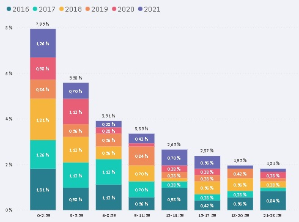
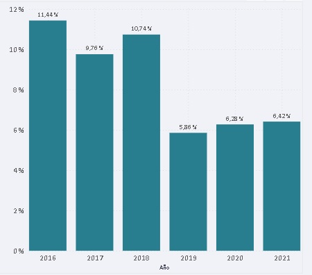
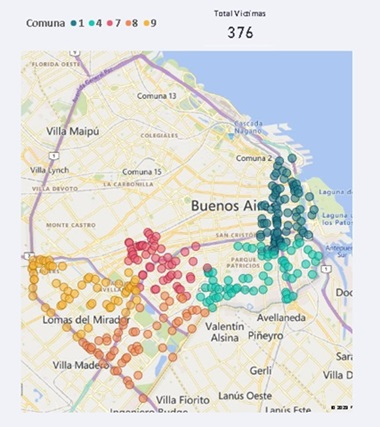

# Víctimas Fatales en Siniestros Viales, Ciudad de Buenos Aires, Años 2016 a 2021

## Simulación de Rol de Data Analyst
## Proyecto Final n°2, Carrera de [Data Science, Henry](https://www.soyhenry.com/carrera-data-science)

### Introducción

En el presente proyecto se trabaja con datos del **Observatorio de Movilidad y Seguridad Vial (OMSV)**, centro de estudios que se encuentra bajo la órbita de la Secretaría de Transporte del Gobierno de la Ciudad Autónoma de Buenos Aires (CABA). 

Se solicitó generar información que le permita a las autoridades locales tomar medidas para disminuir la cantidad de víctimas fatales de los siniestros viales ocurridos en CABA. Para ello, se dispuso de un [dataset sobre homicidios en siniestros viales acaecidos en la Ciudad de Buenos Aires durante el periodo 2016-2021](https://data.buenosaires.gob.ar/dataset/victimas-siniestros-viales/resource/d445be0a-2a5c-4acb-8899-bce9cb2d378f). En el mismo archivo se puede encontrar un diccionario con los detalles sobre las variables.

La información sobre los siniestos **se puede agrupar en 3 dimensiones: participantes, temporal y espacial**.
Para cada una se cuentan con distintas variables que fueron analizadas en los procesos de ETL y EDA.

A partir de esa exploración inicial, se determinó qué variables se priorizarían para el desarrollo de un dashboard que permita profundizar el análisis.

## EDA - [Notebook EDA.ipynb](EDA.ipynb)
Al inicio del notebook se realizar proceso de ETL, procurando realizar las transformaciones necesarias para trabajar con la información y realizar el Análisis Exploratorio de Datos (EDA).

Se presenan algunos hallazagos preliminares, que sirvieron para determinar algunos aspectos que se consideran de relevancia para el análisis de los datos.

### Hallazgos preliminares
- La cantidad de víctimas disminuye considerablemente a partir de 2019, manteniendo valores por debajo de los años anteriores. Sin embargo, en 2021 se registra un aumento en general respecto a 2020. Estos datos se pueden analizar considerando el contexto de la pandemia de COVID y el aislamiento preventivo, motivo que puede explicar los valores mínimos de 2020.
- A lo largo de los años, no se observan tendencias claras en relación al mes de los hechos. La cantidad de víctimas por mes varía considerablemente año a año.
- Se observan valores más altos para los días sábado y domingo (fines de semana), especialmente en horas de la madrugada (desde las 3 am).
- Las comunas con mayor cantidad de víctimas son, en este orden, Comunas 1, 4, 9, 8 y 7. La Comuna 1 es por un márgen significativo la que mayor cantidad de víctimas presenta.
- Más del 60% de los siniestros ocurren en avenidas.
- Más del 70% de los siniestros ocurren en cruces.
- Aproximadamente el 50% ocurren en avenidas con un cruce.
- Más del 85% de las víctimas son motos o peatones.
- Más de un 30% de los acusados (responsables del hecho) son autos.
- Aproximadamente el 50% de las víctimas se encuentran entre los 25 y 40 años de edad y de estos más del 80% son masculinos.

### Definición de variables para visualizar en el Dashboard
A partir de estas observaciones y la exploración realizada, se definieron algunas variables consideradas de mayor relevancia y que se utilizaron en el Dashboard:
**Variables temporales**: Año, Rango Horario y Fin de Semana (se agrupan datos según sea o no fin de semana).
**Variables espaciales**: Tipo de Calle, Cruce (si el hecho ocurrió en un cruce con otra arteria o no), Comuna.

## Visualización y Análisis de los datos - [Dashboard interactivo en Power BI](PI_homicidios.pbix)
En el Dashboard se pueden encontrar las páginas 'Temporal', 'Tipos de Calles' y 'Comunas'. En cada una se aplicaron distintos filtros de visualización a partir de los cuales se profundizó en el análisis y permitió extraer información valiosa para la toma de decisiones.

### Rango Horario, Semana/Fin de Semana
Para este análisis se desarrolló una escala de rangos de 3 horas, comenzando por las 0 horas. Es decir, 8 rangos de 3 horas por día.

En el agregado total (de 2016 a 2021) se observa una tendencia con **picos de víctimas en el rango de 0-2:59 horaas**, que **decrece regularmente a lo largo del día**.

Para los días de semana esta tendencia es menos pronunciada que los fines de semana. Aproximadamente el 30% de los siniestros ocurren en día de semana, en el rango de 0 a 9 horas.

Los **fines de semana** se observa un decrecimiento pronunciado. El rango de 0-2:59 horas para fines de semana concentra casi el 8% de las víctimas totales. Para el rango 3-5:59 horas cae a poco más del 5% , de 6-8:59 horas casi al 4% y continua decreciendo hasta el final del día. Teniendo en cuenta esta información, se observa que en solo 2 días (sábado y domingo), en un rango de 9 hs cada dia (**de 0 a 9 hs**), se concentra **más del 18% de las víctimas totales**.

### Tipos de Calle
Se puede visualizar información filtrando por el tipo de arteria y según si el accidente ocurrió en un cruce o no.

En los hallazgos preliminares se mencióno que en relación al tipo de arteria predominan las avenidas y que la mayor parte de los siniestros se producen en cruces de arterias.

El siguiente gráfico muestra valores porcentuales de accidentes en avenidas con cruce, sobre el total de accidentes. Se observa que **más del 50% del total de víctimas se producen en hechos en avenidas con un cruce**. Este dato resulta sumamente relevante, siendo que el desarrolló de políticas de prevención para estos casos podría tener un impacto sumamente significativo en la reducción de siniestros y víctimas.

### Comunas
Se observan, cómo se mencionó anteriormente, una gran concentración de víctimas en las Comunas 1, 4, 9, 8 y 7 (en ese orden, de mayor a menor). 

En total suman más del 50% del total. Desde ya los valores absolutos se deberán contrastar con el total de población por comuna con el objetivo de analizar las tasas correspondientes, lo cual no se realizó en el marco de este proyecto.

Sin embargo, se puede observar que estas comunas están agrupadas en el cordón sur-oeste de la ciudad y que están conectadas entre sí por grandes arterias (avenidas y autopistas).

## KPIs

Como parte del análisis se solicitó realizar 3 mediciones de KPI en relación a los siguientes objetivos:
- KPI 1: Reducir en un 10% la tasa de homicidios en siniestros viales de los últimos seis meses, en CABA, en comparación con la tasa de homicidios en siniestros viales del semestre anterior.
- KPI 2: Reducir en un 7% la cantidad de accidentes mortales de motociclistas en el último año, en CABA, respecto al año anterior.
- KPI 3: Reducir en un 10% la tasa de homicidios en siniestros viales en Avenidas con Cruce del último año en comparación con el año anterior.

La tasa de víctimas se calculó por cada 100 mil habitantes.

A partir de las mediciones realizadas, se concluye que:
- KPI 1 cumplido, pasando de una tasa de víctimas de 1.76 en el primer semestre de 2021 a 1.35 en el segundo.
- KPI 2 no cumplido, se registra un aumento de más del 58% en víctimas motociclistas entre 2020 y 2021.
- KPI 3 no cumplido, teniendo una tasa para 2021 de 1.47 víctimas mientras que el valor objetivo es de 1.3 víctimas.

## Conclusiones

En base a la información analizada se obsevaron ciertas condiciones bajo las cuales se producen mayor cantidad de víctimas. El desarrollo de políticas teniendo en cuenta dichas condiciones podría tener alto impacto en la reducción de víctimas.

Especialmente se recomienda el desarrollo de acciones orientadas a:
- Avenidas con Cruces.
- Fines de Semana de 0 a 6 hs.
- Arterias de conexión entre las comunas 1, 4, 7, 8 y 9 (sur-oeste de la ciudad).

